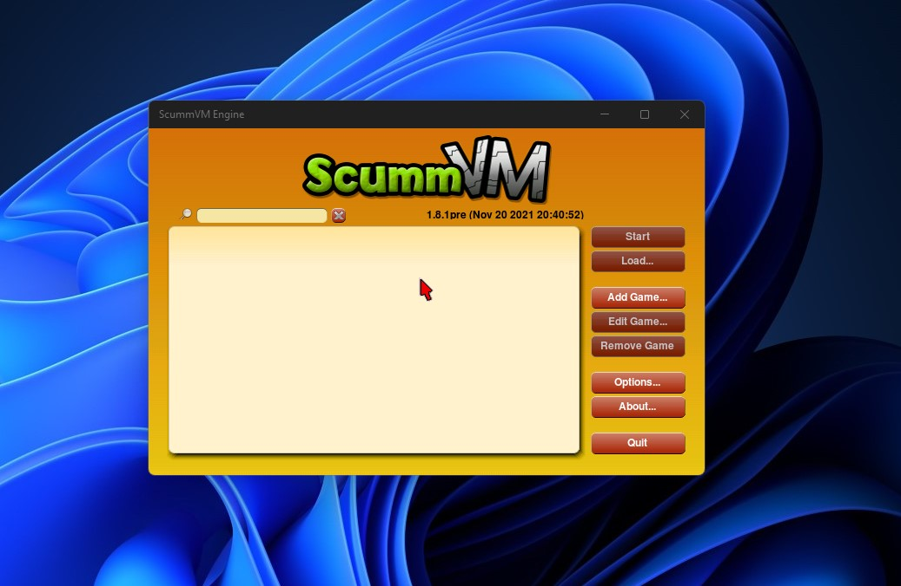

   
  <b>ScummVM UWP port with few improvements for stability</b> 
  <a href="./src">Source</a> |
  <a href="https://github.com/Lybr4/scummvm">Original Project</a> 
    
    

# Features

- Resolve crash issue when (folder removed or moved)

- Add loading progress for mobile device

- Add notice for touch screens (how to show menu in-game)

- Bugs fixes

# Known Issue

On mobile only the Tile will not open the app

It will appear like crashed, so you have to install

ScummVM Play and use it to launch the app

# Target

It will work with build 10240 and above, ARM - x86

If you want x64 you need to compile the libraries in 'src' for x64

# Supported Games

Visit http://www.scummvm.org

# Build and compile

-For libraries read the info in ScummVM Libs folder

-The current release built using V.S.2019

-Once you downloaded the project and setup the libraries location you will be able to build the project

# Future

- Need to update/add the engines without break the UWP functions

- Update SDL to the latest (if possible)

- Add remove button or auto cleanup for the unused folders from Recent list

- Append newer options

- Update scummvm core to higher version (if possible)

# Credits

Developed by ScummVM Team

Stability improvements by Bashar Astifan

